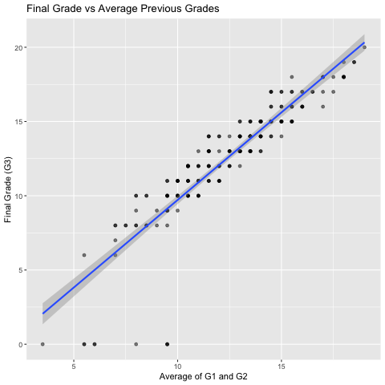
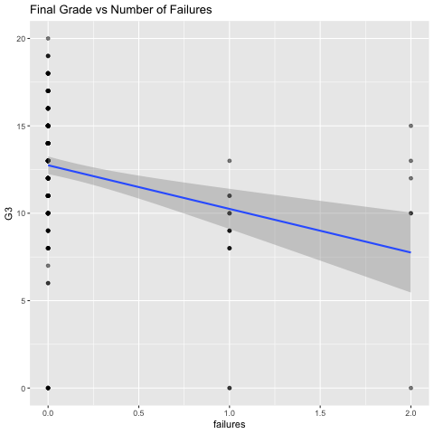
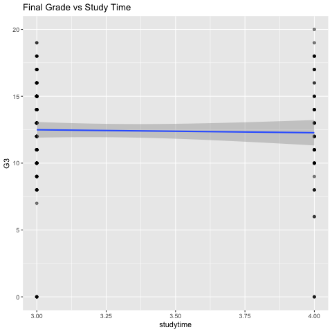

# Student Performance Analysis

This project implements a predictive model to estimate final student grades (G3) using demographic, social, and academic data. By integrating records from both Mathematics and Portuguese courses, the analysis identifies the primary drivers of academic success across a combined dataset of 1,044 students.

The analysis focuses specifically on high-engagement students (where `studytime > 2`) to determine which social and academic factors impact those already putting in significant effort. By calculating academic momentum (`avg_grade`) and a custom resilience metric (`study_per_failure`), the project isolates the most significant predictors of final outcomes.

## Project Structure
- `data/` — Raw CSV files (student-mat.csv and student-por.csv)
- `scripts/analysis.R` — Full analysis script including data cleaning and modeling
- `output/` — Regression results and exported plots

## Methodology

The analysis utilizes multiple linear regression to test the influence of academic history and lifestyle variables:

- **Data Integration:** Merges Math and Portuguese datasets with identical 33-variable structures.
- **Feature Engineering:** Calculates `avg_grade` (average of G1 and G2) and `study_per_failure` (study time relative to past failures).
- **Regression Specification:** `lm(G3 ~ avg_grade + studytime + failures + absences + sex + freetime + goout + Dalc + Walc + health)`

## Key Results

- **Predictive Power:** The model explains 81.4% of the variance in final grades (Multiple R-squared: 0.814).
- **Primary Driver:** `avg_grade` is the strongest predictor with an estimate of 1.166, indicating that early-semester momentum is the most reliable indicator of final success.
- **Model Reliability:** The overall p-value of < 2.2e-16 demonstrates that the results are highly statistically significant.

## Visualizations





## Example Code

To execute the primary model after loading and merging the datasets:

```r
# Filter for high-effort students (studytime level 3 and 4)
student <- data %>% filter(studytime > 2)

# Multiple linear regression predicting final grade (G3)
model <- lm(G3 ~ avg_grade + studytime + failures + absences + 
            sex + freetime + goout + Dalc + Walc + health, 
            data = student)

# Review statistical coefficients and significance
summary(model)
```

## Data Source

Dataset sourced from the [UCI Machine Learning Repository](https://archive.ics.uci.edu/ml/datasets/student+performance), covering attributes such as family background, social activities, and academic history across two Portuguese schools.
